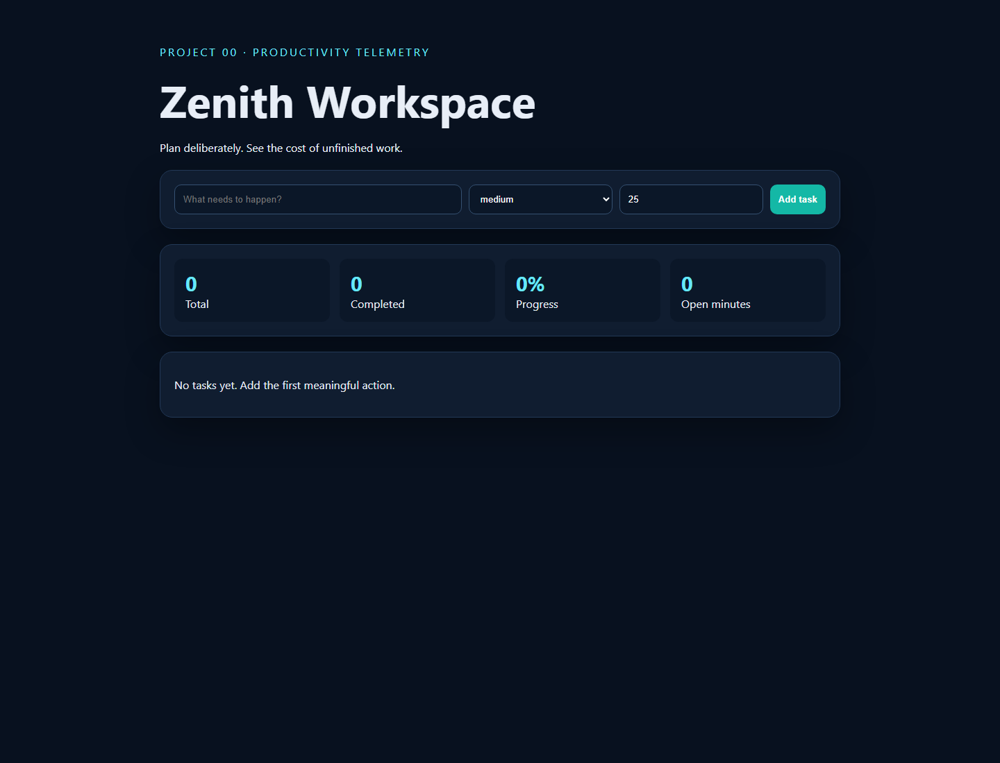

# 00 · Zenith Dynamic Todo Workspace



An independently runnable FastAPI task workspace whose dashboard turns work-in-progress into visible completion and workload metrics.

## Run

```bash
python -m pip install -r requirements.txt
python -m uvicorn app:app --reload --port 8000
```

Open `http://127.0.0.1:8000`. Run tests with `python -m unittest -v`.

## UX tour

- Add a validated task with priority and estimated minutes.
- Complete or delete tasks without reloading the page.
- Watch completion rate and open workload update immediately.
- Inspect `/docs` for the generated API contract.

## Architecture and limitations

The browser uses a small dependency-free client against a typed FastAPI API. The current store is process memory: restarting the server clears tasks, making this suitable as a tested UX/API baseline rather than a production task service. SQLite persistence and user identity are planned enhancements.
