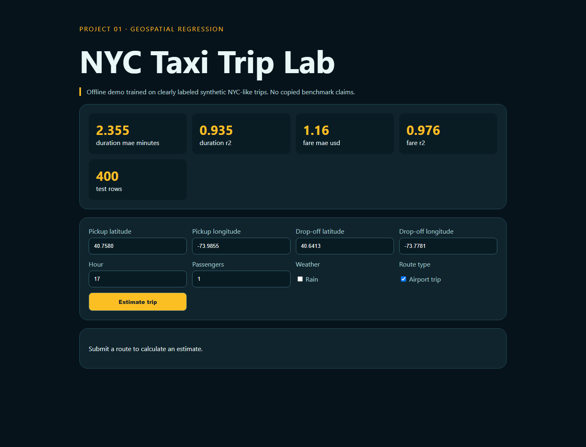

# 01 · NYC Taxi Trip Prediction



A leakage-aware duration and fare regression application with geospatial distance, cyclical hour encoding, reproducible holdout metrics, a JSON API, and an interactive trip estimator.

## Run and test

```bash
python -m pip install -r requirements.txt
python -m uvicorn app:app --reload --port 8001
python -m unittest -v
```

Open `http://127.0.0.1:8001`; API documentation is at `/docs`.

## CRISP-DM snapshot

1. **Business:** estimate trip time and price before dispatch.
2. **Data understanding:** distance, pickup hour, party size, rain, and airport route influence targets.
3. **Preparation:** derive great-circle distance and cyclical hour features; split before model fitting.
4. **Modeling:** independent random forests for duration and fare.
5. **Evaluation:** MAE and R² on a seeded 25% holdout.
6. **Deployment:** typed FastAPI endpoint and responsive browser form.

## Provenance and limitations

The default dataset is deterministic, generated, NYC-like demonstration data—not the Kaggle competition dataset. It supports a fully offline experiment but does not capture road topology, live traffic, tolls, or real pricing rules. Predictions are educational and must not be used for dispatch or billing.
