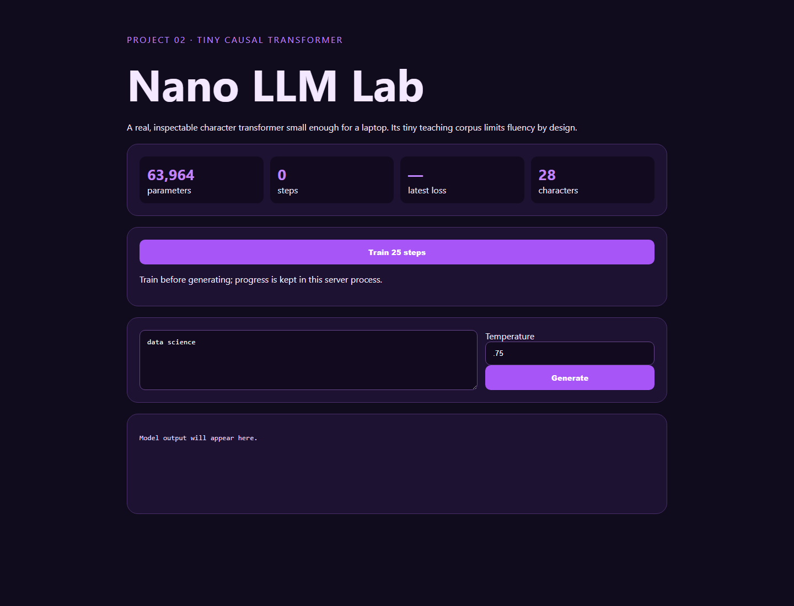

# 02 · Nano LLM Transformer



A small character-level causal transformer implemented in PyTorch with learned token/position embeddings, multi-head self-attention, GELU feed-forward blocks, layer normalization, gradient clipping, interactive training, and stochastic generation.

## Run and test

```bash
python -m pip install -r requirements.txt
python -m uvicorn app:app --reload --port 8002
python -m unittest -v
```

Open `http://127.0.0.1:8002`, train several batches, then generate text.

## Data and limitations

The checked-in corpus is a tiny, authored data-science safety primer. It has transparent provenance and makes testing fast, but it cannot produce a generally capable chatbot. Repetition, spelling errors, and weak long-range coherence are expected evidence of limited data/capacity—not hidden behind curated responses.

## CRISP-DM snapshot

The business goal is teaching transformer mechanics locally. Data understanding is visible through corpus and vocabulary statistics; preparation is character tokenization; modeling is next-character cross-entropy; evaluation uses loss trends and qualitative samples; deployment is an on-demand FastAPI process.
