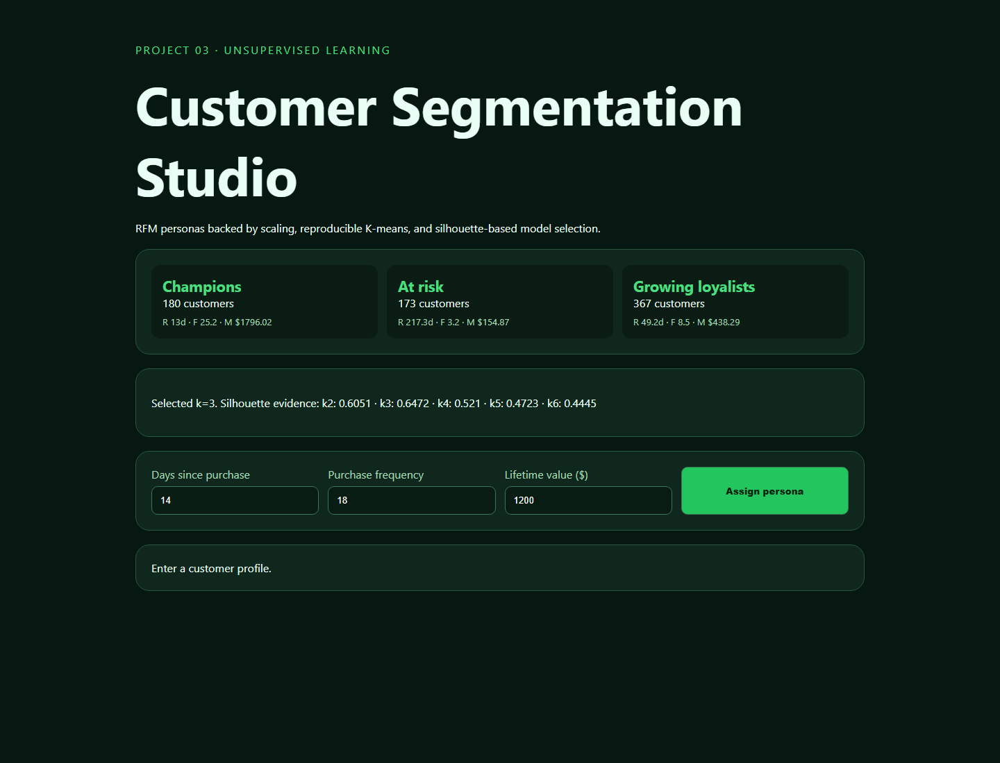

# 03 · Customer Segmentation Studio



An independently runnable RFM clustering experiment with deterministic demo data, scale-aware K-means, silhouette model selection, interpretable segment profiles, and live customer assignment.

## Run and test

```bash
python -m pip install -r requirements.txt
python -m uvicorn app:app --reload --port 8003
python -m unittest -v
```

## CRISP-DM and methodology

The business objective is differentiated retention strategy. Synthetic recency, frequency, and monetary values provide a safe offline dataset. Features are standardized before distance-based clustering. Candidate values `k=2..6` are compared using silhouette score, then the selected pipeline is refit and profiled.

## Limitations

Personas are descriptive decision aids, not discovered human identities or causal treatment rules. The generated data contains clearer separation than most production customer data. A real deployment must add cohort stability, consent, fairness review, campaign lift tests, and a documented data retention policy.
