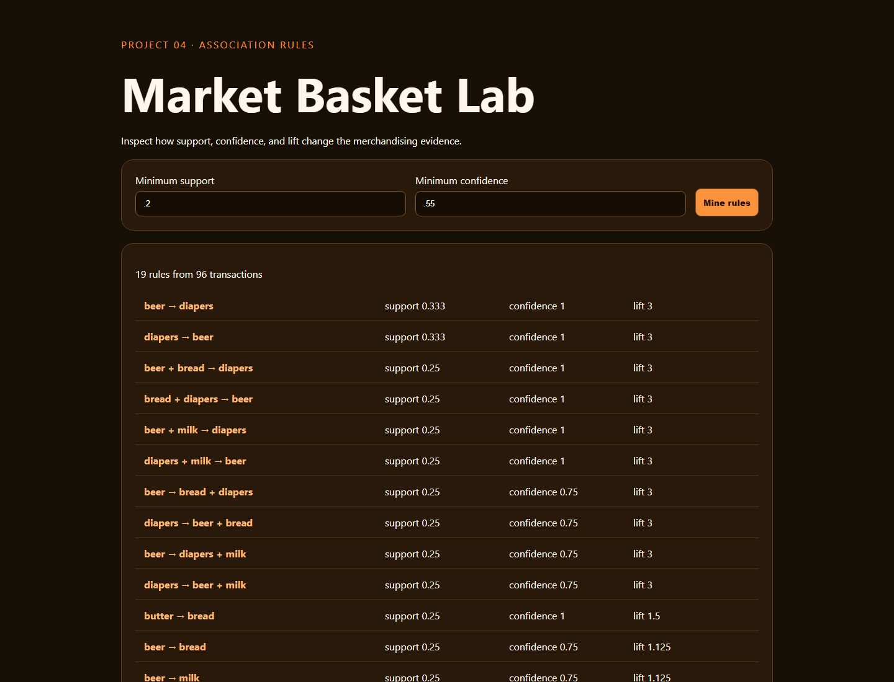

# 04 · Market Basket Pattern Lab



A dependency-light Apriori-style association-rule miner with editable support/confidence thresholds and ranked lift evidence.

```bash
python -m pip install -r requirements.txt
python -m uvicorn app:app --reload --port 8004
python -m unittest -v
```

The default baskets are authored demonstration transactions repeated to support a stable offline demo; they are not claimed as a Kaggle sample. Association does not imply causation. Real recommendations require temporal validation, inventory constraints, margin analysis, and controlled experiments.
