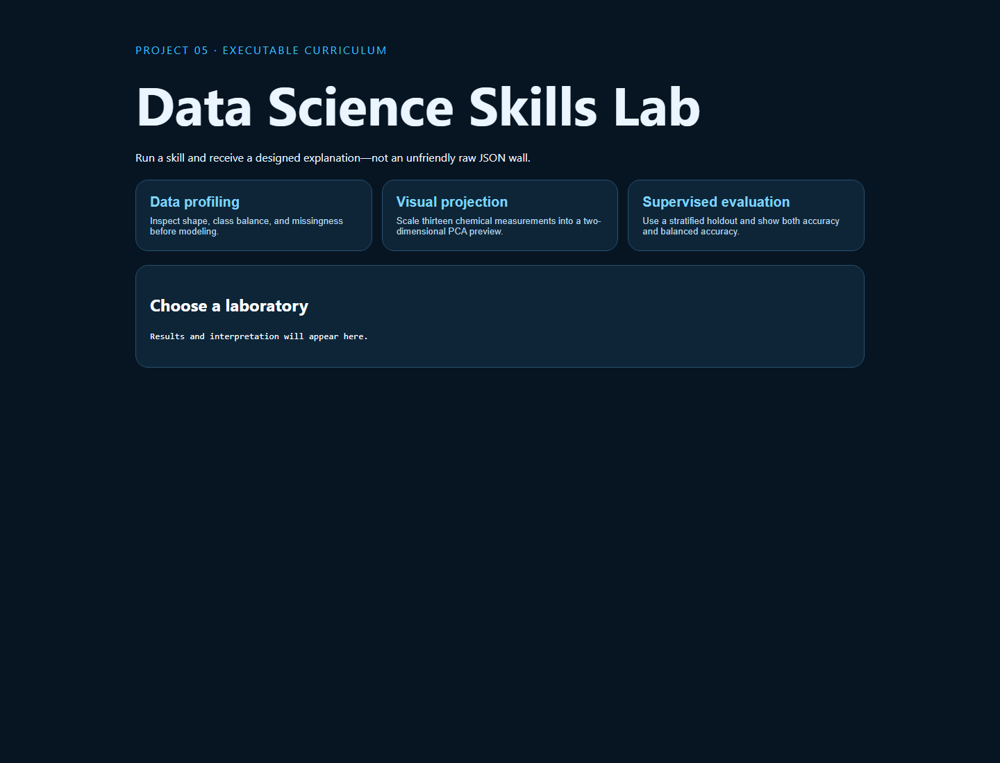

# 05 · Data Science Skills Lab



An executable learning application built around the scikit-learn Wine dataset. It turns profiling, PCA, and classification outputs into concise dashboard explanations.

```bash
python -m pip install -r requirements.txt
python -m uvicorn app:app --reload --port 8005
python -m unittest -v
```

The built-in Wine dataset has 178 rows and 13 numeric chemical measurements. The laboratories are small demonstrations, not a claim to exhaust every external skill collection. Future lessons will add preprocessing leakage exercises, calibration, fairness, explainability, and time-series validation.
