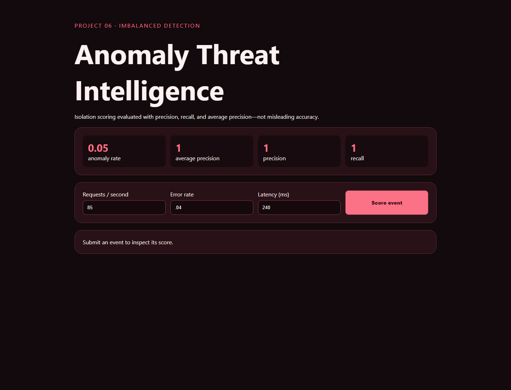

# 06 · Anomaly Threat Intelligence



An Isolation Forest service-telemetry experiment that makes its 5% anomaly prevalence explicit and evaluates ranking/detection using appropriate imbalanced metrics.

```bash
python -m pip install -r requirements.txt
python -m uvicorn app:app --reload --port 8006
python -m unittest -v
```

The generated data deliberately makes incidents separable so the mechanics can be verified offline. Scores are triage aids, not proof of malicious activity. Production use requires temporal validation, alert-budget tuning, analyst feedback, drift monitoring, and careful handling of novel but benign events.
