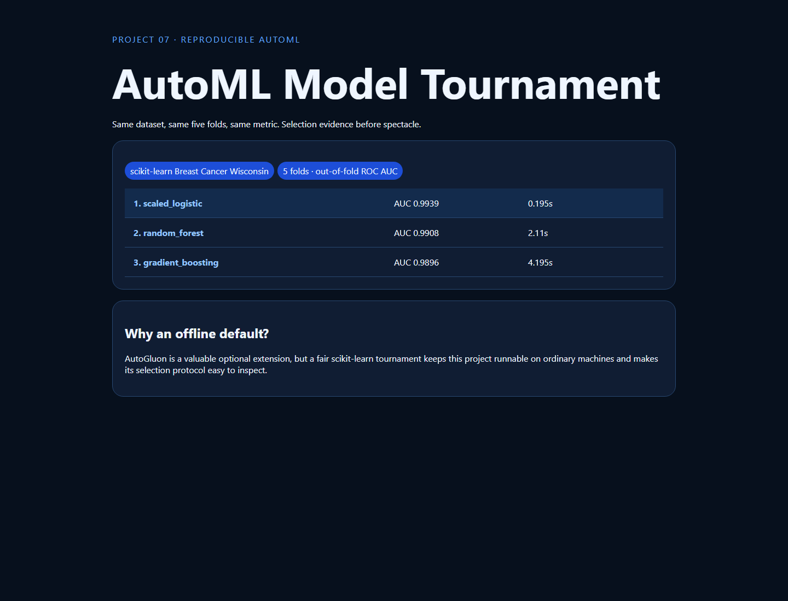

# 07 · AutoML Model Tournament



A cached, deterministic comparison of scaled logistic regression, random forest, and gradient boosting on five identical stratified folds. Models are ranked by out-of-fold ROC AUC with measured runtime.

```bash
python -m pip install -r requirements.txt
python -m uvicorn app:app --reload --port 8007
python -m unittest -v
```

The bundled Breast Cancer Wisconsin dataset makes the default run network-free. This compact tournament demonstrates fair selection but does not reproduce AutoGluon's stacking system; an optional adapter will be added after the core portfolio is stable.
