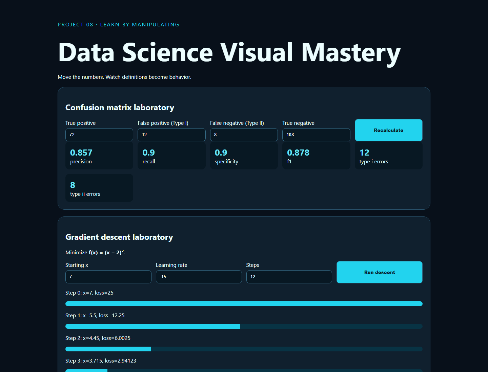

# 08 · Data Science Visual Mastery



Interactive laboratories for classification errors, precision/recall, Bayesian base rates, derivatives, and gradient descent.

```bash
python -m pip install -r requirements.txt
python -m uvicorn app:app --reload --port 8008
python -m unittest -v
```

The key design principle is manipulability: learners change counts and optimization parameters, then observe the derived quantities. The current release covers core numerical intuition; a later static export will add chain-rule diagrams, backpropagation exercises, more quizzes, and interview cards.

## Video walkthrough

The code and UX walkthrough will be uploaded to this project folder as `08_datascience_visual_mastery.mp4`. Status: pending recording.
