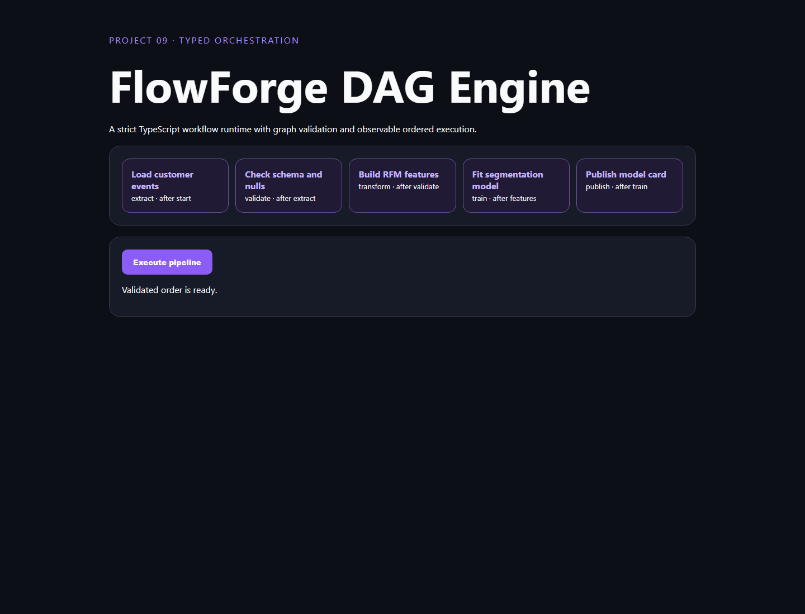

# 09 · FlowForge DAG Engine



An independent strict-TypeScript analytical workflow engine. It validates unique IDs and dependencies, rejects cycles with Kahn's algorithm, executes in topological order, and visualizes run progress.

```bash
npm install
npm test
npm run dev
```

Open `http://127.0.0.1:8009`. Build for production with `npm run build && npm start`.

The current executor is deliberately sequential and in-memory. Production evolution would add bounded parallelism, cancellation, retries, persisted event history, authentication, worker isolation, and operation-specific adapters.
