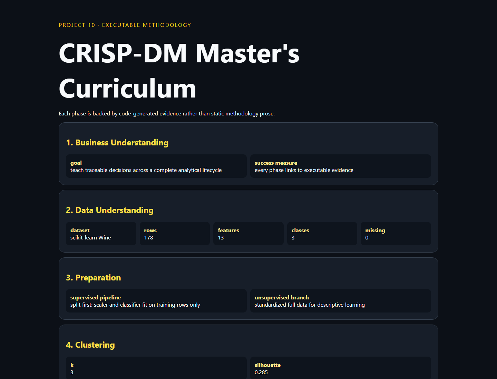

# 10 · CRISP-DM Master's Curriculum



One independently runnable evidence dashboard spanning business understanding, data understanding, preparation, clustering, anomalies, supervised learning, an association rule, random-hyperplane LSH, and deployment limitations.

```bash
python -m pip install -r requirements.txt
python -m uvicorn app:app --reload --port 8010
python -m unittest -v
```

The scikit-learn Wine dataset keeps execution deterministic and offline. The breadth is educational: an association demonstration on median-binarized features and a compact LSH index are not substitutes for a domain-validated recommendation or retrieval system.
