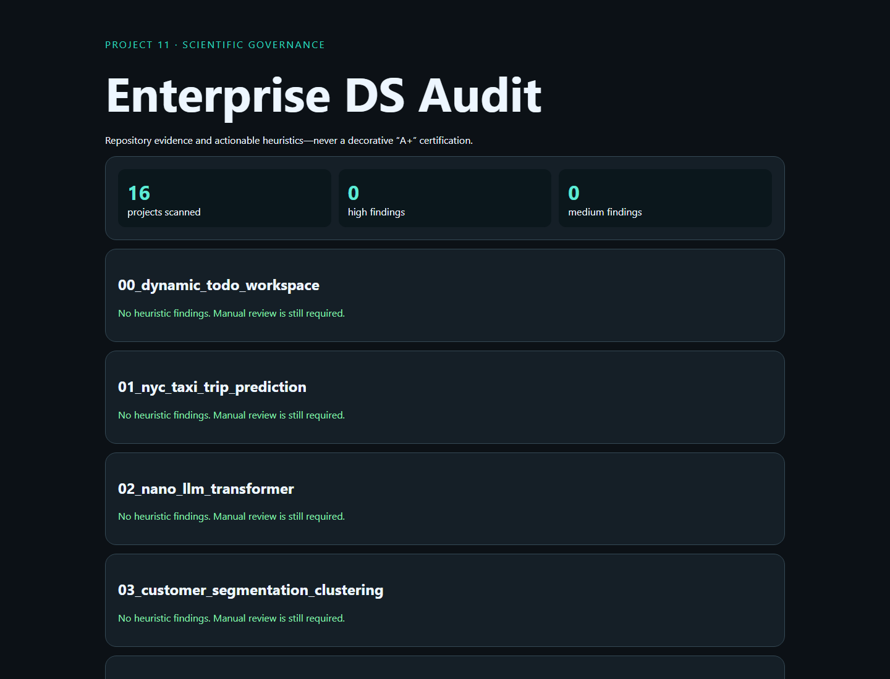

# 11 · Enterprise Data Science Audit



A live repository auditor that discovers numbered projects and checks documentation, runtime code, tests, parseability, seeds, suspicious preprocessing order, and metric risks.

```bash
python -m pip install -r requirements.txt
python -m uvicorn app:app --reload --port 8011
python -m unittest -v
```

Static token and AST heuristics can identify review targets but cannot prove absence of leakage, fairness issues, reward hacking, or operational failure. Every clear report still requires dataset review, executed tests, experiment lineage, and expert sign-off.
