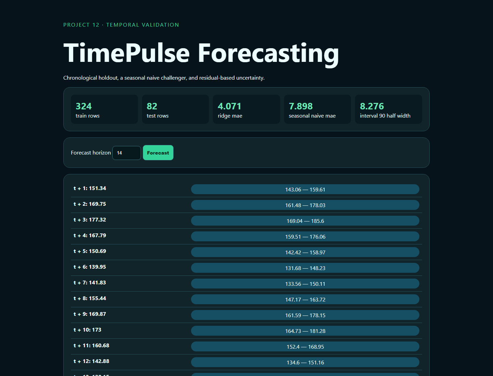

# 12 · TimePulse Forecasting



A network-free seasonal-demand forecaster using fourteen lagged observations, chronological holdout evaluation, a weekly naive baseline, recursive forecasting, and empirical 90% residual bands.

```bash
python -m pip install -r requirements.txt
python -m uvicorn app:app --reload --port 8012
python -m unittest -v
```

The series is deterministic synthetic demand. Intervals summarize held-out absolute residuals and do not guarantee calibrated conditional coverage. Recursive multi-step error can compound; production work needs rolling-origin evaluation, drift monitoring, holiday regressors, and conformal calibration.

## Video walkthrough

The code and UX walkthrough will be uploaded to this project folder as `12_timeseries_forecasting.mp4`. Status: pending recording.
