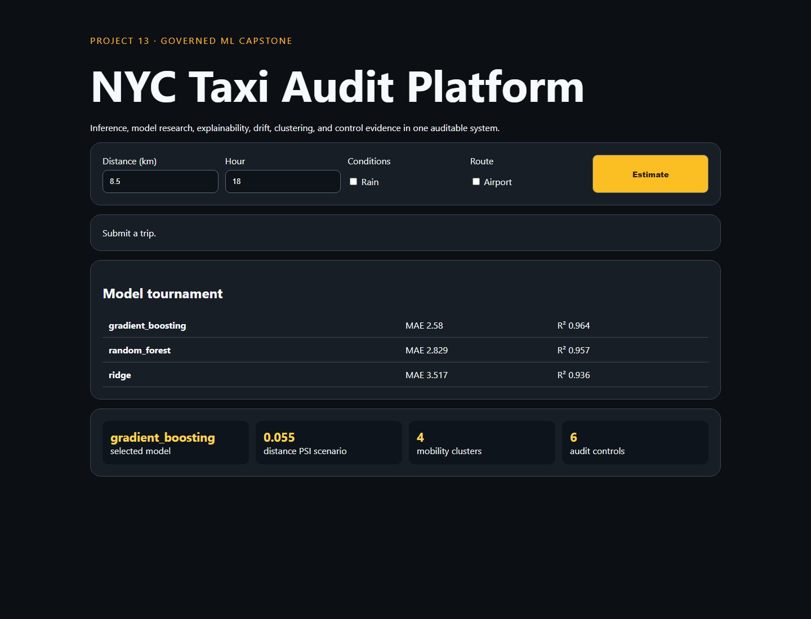

# 13 · Governed NYC Taxi Audit Platform



A capstone model-governance application combining trip-duration inference, a reproducible model tournament, permutation importance, mobility clusters, a population-stability drift scenario, control evidence, and a model card.

```bash
python -m pip install -r requirements.txt
python -m uvicorn app:app --reload --port 8013
python -m unittest -v
```

The default training set is generated and explicitly labeled. The system demonstrates governance mechanics but is not a ten-page external scientific audit and makes no production certification claim. Real deployment would require TLC data ingestion, geospatial/temporal validation, experiment persistence, authentication, monitoring, and human approvals.
