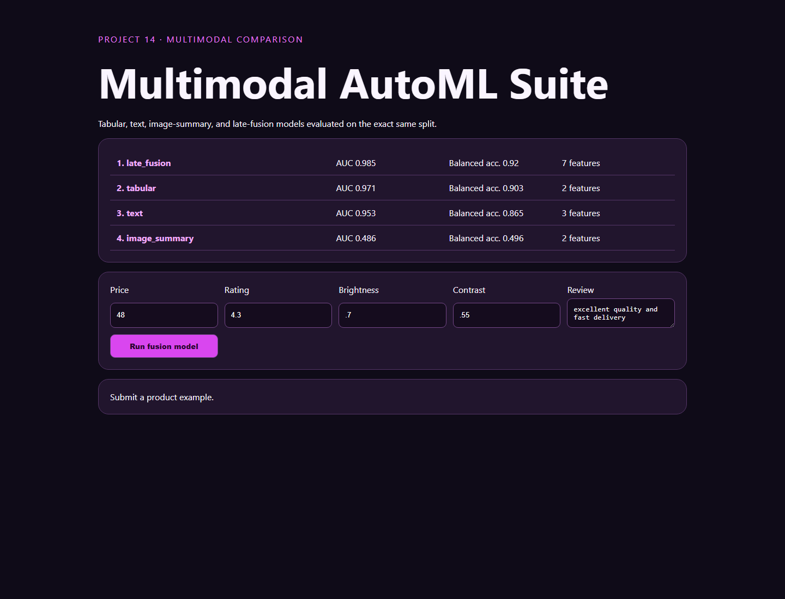

# 14 · Multimodal AutoML Suite



A deterministic benchmark comparing tabular, text-derived, image-summary, and late-fusion classifiers on the same product-quality task and identical stratified holdout.

```bash
python -m pip install -r requirements.txt
python -m uvicorn app:app --reload --port 8014
python -m unittest -v
```

Images are represented by brightness and contrast summaries and text by transparent lexical counts, so this is a multimodal fusion teaching baseline—not a vision-language foundation model. AutoGluon is optional because its package and model downloads are unsuitable for the offline default.
