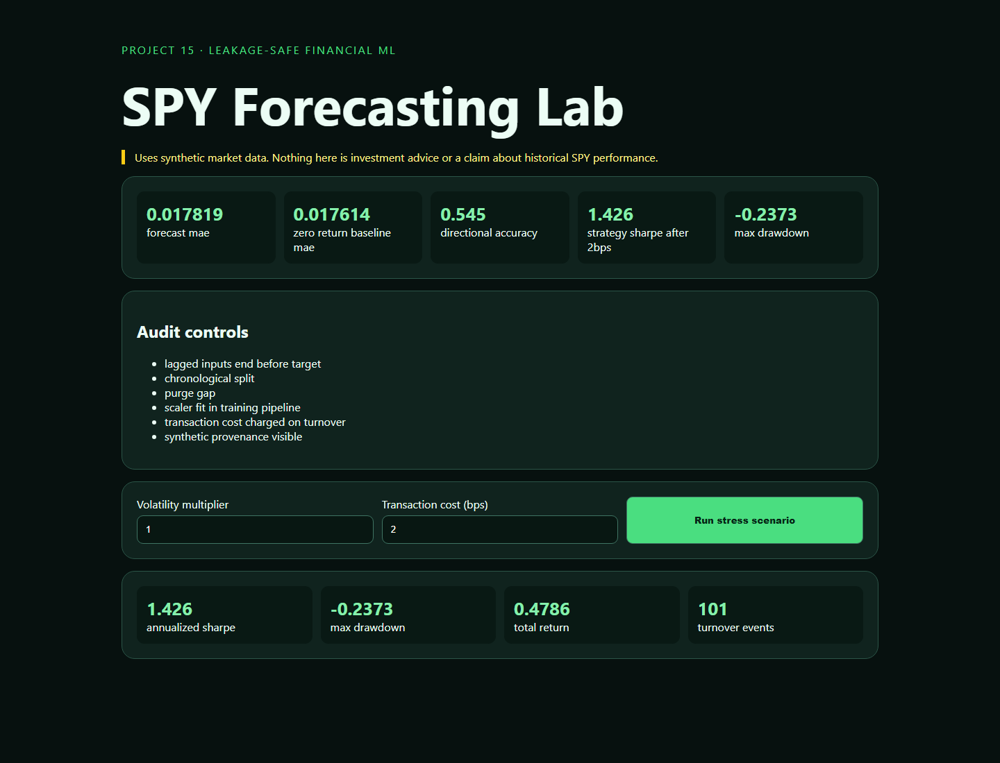

# 15 · SPY Leakage-Safe Forecasting Lab



A cost-aware financial-ML teaching application with synthetic prices, strictly lagged returns, purged chronological evaluation, a train-only robust scaler, Ridge forecast, zero-return baseline, directional accuracy, turnover costs, Sharpe ratio, drawdown, and stress scenarios.

```bash
python -m pip install -r requirements.txt
python -m uvicorn app:app --reload --port 8015
python -m unittest -v
```

## Critical disclaimer

The built-in series is synthetic and is not historical SPY. Its backtest is a software and methodology demonstration, not investment advice, a trading recommendation, or evidence of future returns. A serious study must ingest point-in-time adjusted market data, model execution/borrow costs, use nested walk-forward selection, and survive independent reproduction.

## Video walkthrough

The code and UX walkthrough will be uploaded to this project folder as `15_spy_timeseries_sota_forecasting.mp4`. Status: pending recording.
